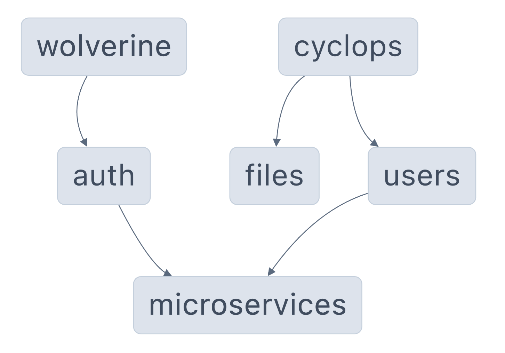

# NestJS Microservices [PoC]

Welcome to the NestJS Microservices project. This project is a collection of microservices that are designed to work together to provide a complete solution for a specific business domain.
The microservices are designed to be independent of each other and can be deployed and scaled independently.

By [@nikosanif](https://x.com/nikosanif)

[](https://github.com/nikosanif/nestjs-microservices/blob/main/LICENSE)
[](https://github.com/prettier/prettier)
[](https://x.com/nikosanif)

## Table of contents

- [Getting started](#getting-started)
  - [Prerequisites](#prerequisites)
  - [Running the project](#running-the-project)
- [Structure overview](#structure-overview)
- [Features](#features)

## Getting started

### Prerequisites

- Install [Node.js](https://nodejs.org/en/) v20.15 (npm v10.7.0)
- Install [Docker](https://www.docker.com/) and [Docker Compose](https://docs.docker.com/compose/install/)
- For protobuf, you need to have `protoc` installed. You can install it using the following command:

  ```sh
  # macOS
  brew install protobuf

  # Ubuntu
  sudo apt install protobuf-compiler
  ```

### Running the project

1. Clone the repository and navigate to the project directory:

   ```sh
   git clone <repo-url>
   cd nestjs-microservices
   ```

2. Install the dependencies:

   ```sh
   npm install
   ```

3. Build protobuf files:

   ```sh
   # Build the protobuf files
   nx run microservices:build-protobuf
   ```

4. Start microservices:

   ```sh
   # Start required services with docker (database, etc.)
   docker compose -f ./docker/docker-compose.yml up -d

   # In one shell, start the cyclops microservice
   # Users microservice (HTTP + gRPC API)
   npx nx run cyclops:serve

   # In another shell, start the wolverine microservice
   # Auth microservice (HTTP API)
   npx nx run wolverine:serve
   ```

## Structure overview

The project is structured as a monorepo. Each microservice is a separate package within the monorepo. The monorepo is managed using [nx](https://nx.dev/).

The monorepo is structured as follows:

```sh
.
├── apps
│   ├── cyclops         # Agnostic microservice
│   └── wolverine       # Agnostic microservice
│
├── libs
│   ├── microservices
│   │   └── grpc        # gRPC services/models
│   │
│   ├── modules
│   │   ├── auth        # Auth module
│   │   ├── files        # File management module
│   │   └── users       # User management module
│   │
│   ├── sdk
│   │   ├── api         # API utilities for microservices
│   │   ├── common      # Common utilities for microservices
│   │   └── ...         # Other SDKs
│   │
│   └── shared
│       ├── config       # Configuration management
│       └── utils       # Miscellaneous utilities
│
├── tools
│    ├── eslint         # ESLint configuration of monorepo
│    └── scripts        # Helper scripts for development
│
└── ... other files
```

### Graph

The following graph shows the dependencies between the packages in the monorepo.



## Features

- Formatting with Prettier
- Testing with Jest
- Linting with ESLint
  - Boundaries between layers
  - No circular dependencies
- Git hooks with Husky
- Publishable npm package
- Local npm registry with Verdaccio (for development)
- HTTP + gRPC communication
- Protobuf for gRPC
  - Automatic generation of TypeScript types
  - Automatic generation of gRPC services and decorators (directly to NestJS)
- Validation of DTOs
- Configuration management
- API utilities
- Swagger documentation
- Solid architecture

## Useful commands

- `npx nx run <app>:serve` - Start the specified microservice
- `npx nx run <app/lib>:build` - Build the specified app or lib
- `npx nx run <app/lib>:test` - Run tests for the specified app or lib
- `npx nx run microservices:build-protobuf` - Generate TypeScript types and gRPC services from protobuf files
- `npx nx graph` - Generate a dependency graph of the monorepo
- `npm run format:check` - Check if the code is formatted correctly
- `npm run format:write` - Format the code
- `npm run lint` - Lint the code
- `npm run lint:affected` - Lint the affected code

## Contributing

Who is for this? I would love for you to contribute to NestJS Microservices! You can contribute in many ways, such as creating new features, fixing bugs, improving documentation, or suggesting new ideas.

If you have found any bug in the source code or want to _request_ a new feature, you can help by [submitting an issue](https://github.com/nikosanif/nestjs-microservices/issues/new/choose) at GitHub. Even better, you can fork this repository and [submit a PR](https://github.com/nikosanif/nestjs-microservices/compare) with the fix or the new feature description.

## Support

- Star this repository 👆⭐️
- Also, if you are an Angular developer, check out my other repository: [Angular Authentication 🛡️](https://github.com/nikosanif/angular-authentication)

### Author: Nikos Anifantis ✍️

- Fullstack Software Engineer - I’m currently working on Angular & Node.js application development.
- I write stuff at [dev.to/nikosanif](https://dev.to/nikosanif) and [nikosanif.medium.com](https://nikosanif.medium.com/)
- How to reach me: [](https://x.com/nikosanif) or [](https://www.linkedin.com/in/nikosanifantis/)

## License

Feel free to use this repository, but **please star and put a reference to this repository.** :pray: :heart:

[MIT](https://opensource.org/licenses/MIT)
